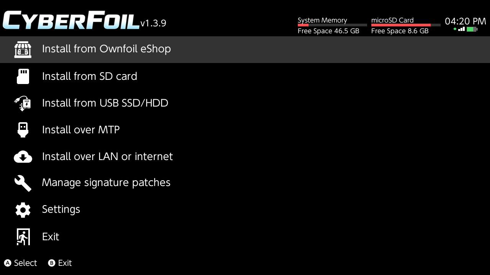
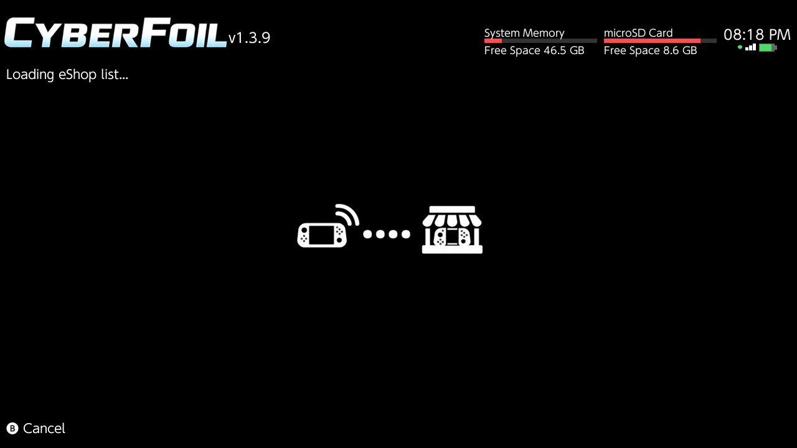
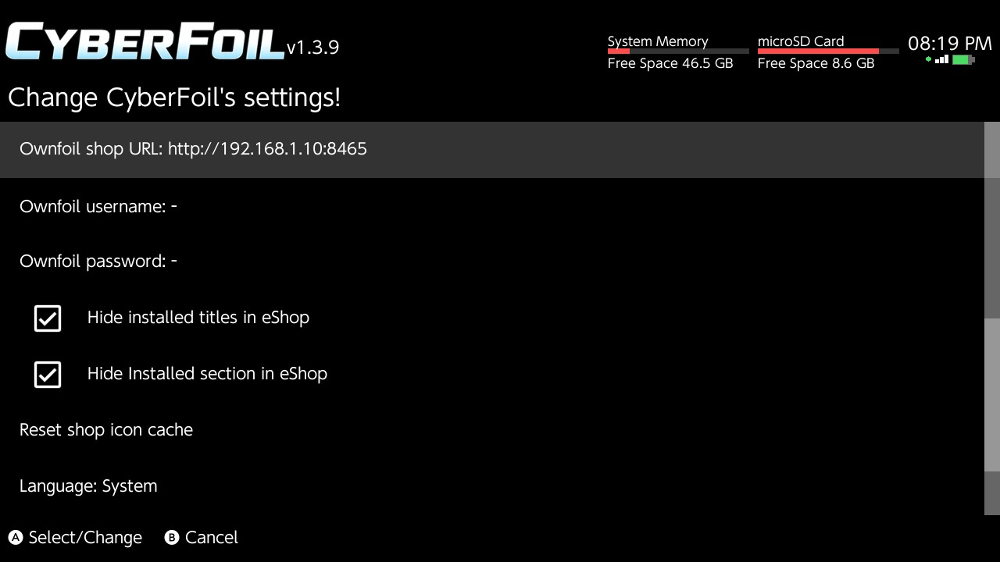

# CyberFoil

## Version: 1.3.11-dev

## Buy me a Coffee at kofi -> https://ko-fi.com/cyberhazard

DEMO Video: [https://youtu.be/4Kl0n9vnVP8](https://youtu.be/NEwC8vgUZLI)

A NSP, NSZ, XCI, & XCZ Installer with basic eShop support for Nintendo Switch

## Features
- Installs NSP/NSZ/XCI/XCZ files and split NSP/XCI files from your SD card
- Installs NSP/NSZ/XCI/XCZ files over LAN or USB from tools such as [NS-USBloader](https://github.com/developersu/ns-usbloader)
- Installs NSP/NSZ/XCI/XCZ files over the internet by URL or Google Drive
- Installs NSP/NSZ/XCI/XCZ files over MTP (USB file transfer)
- Verifies NCAs by header signature before they're installed
- Installs and manages the latest signature patches quickly and easily
- Ownfoil-compatible eShop with sections, search, and cover art previews
- OLED mode for pure-black backgrounds
- Forked from Awoo Installer [Huntereb Awoo Installer](https://github.com/Huntereb/Awoo-Installer)
- Based on [Adubbz Tinfoil](https://github.com/Adubbz/Tinfoil)
- Uses [XorTroll's Plutonium](https://github.com/XorTroll/Plutonium) for a pretty graphical interface

## Why?
Because Tinfoil is no longer being supported and not updated for the new firmware versions.

If you want to do other things like manage installed tickets, titles, and user accounts, check out [Goldleaf](https://github.com/XorTroll/Goldleaf)!

## Ownfoil eShop
CyberFoil supports an Ownfoil-compatible eShop with sections, search, and cover art previews.

Ownfoil fork that has been enhanced to work with this -> [Ownfoil](https://github.com/luketanti/ownfoil)

Setup:
- Run Ownfoil and note its host/port (example: `http://192.168.1.2:8465`).
- In CyberFoil settings, set Shop URL, Username, and Password (optional).
- If your shop is private, make sure credentials are correct.

Browsing:
- L/R switches sections (New, Recommended, Updates, DLC, All, Installed).
- ZR searches in the All section.
- The right-side panel shows the cover art for the focused entry.
- Installed uses a grid layout with D-pad navigation. Press A to view details.
- In grid mode, selected titles show a green highlight and selected overlay.

Updates and DLC:
- Updates/DLC show only when the base title is installed.
- Updates list only shows updates newer than the installed version.

Install flow:
- Select one or more base titles and press Plus to install.
- CyberFoil can prompt to include available updates for selected titles.

Notes:
- Encrypted Ownfoil responses are not supported.
- The Installed section lists content already on the Switch and cannot be installed from.
- The shop list is cached for faster startup (5-minute TTL). Use X to refresh.

New in 1.3.8:
- Option to hide installed titles in the eShop (keeps All available).
- Option to hide the Installed section in the eShop.
- Updates and DLC now respect base install status and installed DLC visibility.

New in 1.3.11:
- MTP installs now work reliably across repeated sessions.
- MTP completion plays the success sound.
- MTP install progress now shows spinner/status with MiB/GiB transfer info.
- MTP completion status is shown inline on the install screen (no blocking popup).
- Optional Album drive exposure during MTP install mode (toggle in Settings).
- Album MTP drive uses libnx image-directory APIs for better Windows Explorer compatibility.
- Main menu and settings support tap-to-select.
- eShop grid selections use a green highlight and selected overlay.

Screenshots:

## Settings Notes
- OLED mode uses pure-black UI backgrounds. Toggle in Settings.
- "Remove anime" hides the mascot art.
- Sounds can be disabled in Settings. You can override sounds by placing `success.wav` and `bark.wav` in `sdmc:/switch/CyberFoil/`.
- MTP setting: you can enable/disable exposing the Album drive while MTP install mode is running.
- Shop icon cache is stored in `sdmc:/switch/CyberFoil/shop_icons/`.
- Touch input: tap items in the main menu and settings to select.

## To Do
- Improve search and navigation for large libraries (Planned)
 - Improve MTP robustness and host compatibility
- Add support for switching between multiple shops
- Preload title images and banners to cache for a faster UI experience
- Create a beginner-friendly video tutorial for the complete setup (CyberFoil and Ownfoil)

## Thanks to
- Huntereb and HookedBehemoth for creating Awoo Installer
- Adubbz and other contributors for [Tinfoil](https://github.com/Adubbz/Tinfoil)
- XorTroll for [Plutonium](https://github.com/XorTroll/Plutonium) and [Goldleaf](https://github.com/XorTroll/Goldleaf)
- blawar (wife strangulator) and nicoboss for [NSZ](https://github.com/nicoboss/nsz) support
- The kind folks at the AtlasNX Discuck (or at least some of them)
- The also kind folks at the RetroNX Discuck (of no direct involvement)
- [namako8982](https://www.pixiv.net/member.php?id=14235616) for the Momiji art
- TheXzoron for being a baka

