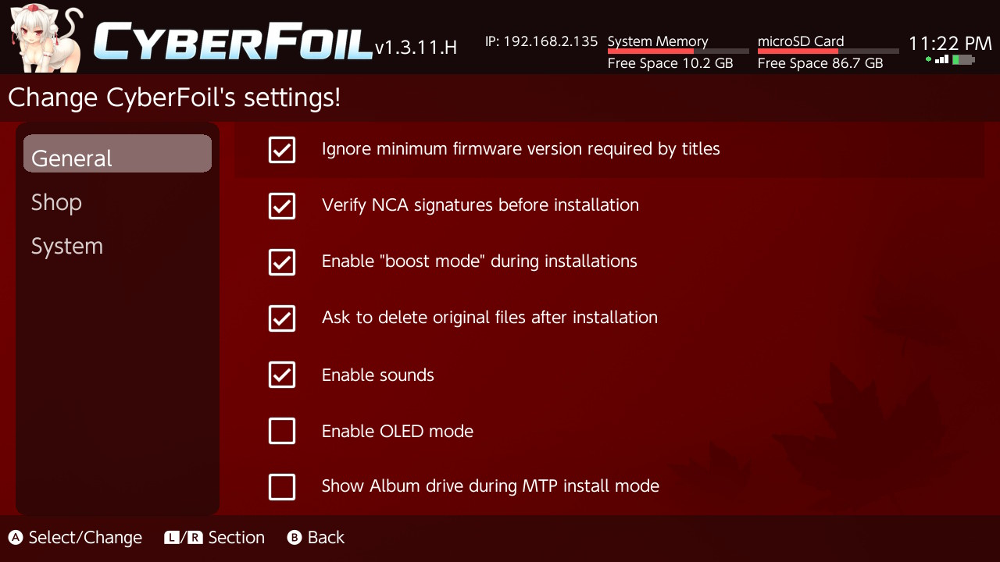
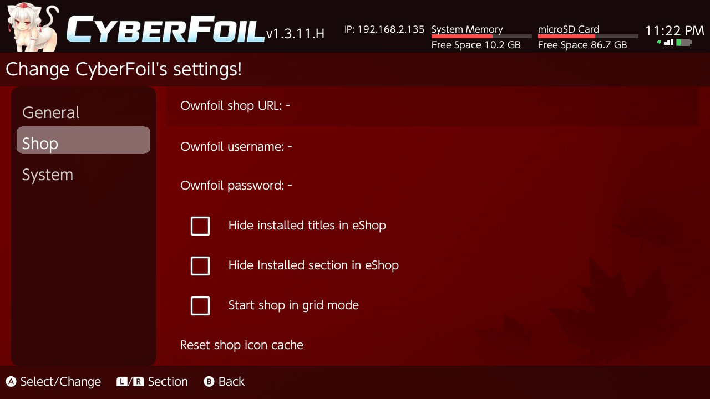
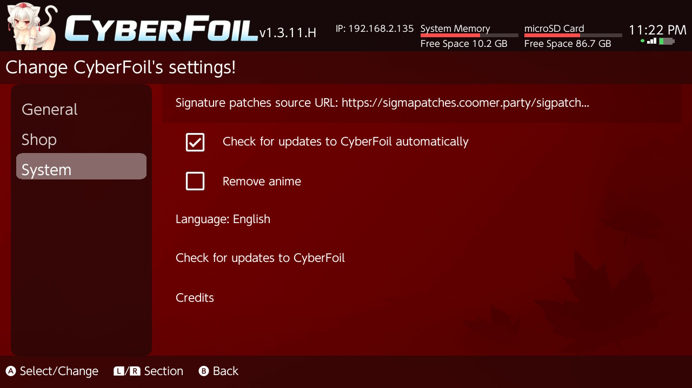

# CyberFoil

## Version: 1.4.0

## Buy me a Coffee at kofi -> https://ko-fi.com/cyberhazard

DEMO Video: [https://youtu.be/4Kl0n9vnVP8](https://youtu.be/NEwC8vgUZLI)

A NSP, NSZ, XCI, & XCZ Installer with basic eShop support for Nintendo Switch

## Features
- Installs NSP/NSZ/XCI/XCZ files and split NSP/XCI files from your SD card
- Installs NSP/NSZ/XCI/XCZ files over LAN or USB from tools such as [NS-USBloader](https://github.com/developersu/ns-usbloader)
- Installs NSP/NSZ/XCI/XCZ files over the internet by URL or Google Drive
- Installs NSP/NSZ/XCI/XCZ files over MTP (USB file transfer)
- Verifies NCAs by header signature before they're installed
- Installs and manages the latest signature patches quickly and easily
- Built-in eShop with sections, search, and cover art previews
- Save Sync in eShop: browse console/server saves, upload with notes, download specific backup versions, and delete server backups
- OLED mode for pure-black backgrounds
- Forked from Awoo Installer [Huntereb Awoo Installer](https://github.com/Huntereb/Awoo-Installer)
- Based on [Adubbz Tinfoil](https://github.com/Adubbz/Tinfoil)
- Uses [XorTroll's Plutonium](https://github.com/XorTroll/Plutonium) for a pretty graphical interface

## Why?
Because Tinfoil is no longer being supported and not updated for the new firmware versions.

If you want to do other things like manage installed tickets, titles, and user accounts, check out [Goldleaf](https://github.com/XorTroll/Goldleaf)!

## eShop
CyberFoil supports an eShop with sections, search, and cover art previews.

Setup:
- Run your shop backend and note its host/port (example: `http://192.168.1.2:8465`).
- In CyberFoil settings, set Shop URL, Username, and Password (optional).
- If your shop is private, make sure credentials are correct.

Browsing:
- L/R switches sections (New, Recommended, Updates, DLC, All, Installed).
- ZR searches in the All section.
- The right-side panel shows the cover art for the focused entry.
- Installed uses a grid layout with D-pad navigation. Press A to view details.
- In grid mode, selected titles show a green highlight and selected overlay.

Updates and DLC:
- Updates/DLC show only when the base title is installed.
- Updates list only shows updates newer than the installed version.

Install flow:
- Select one or more base titles and press Plus to install.
- CyberFoil can prompt to include available updates for selected titles.

Notes:
- Encrypted shop responses are not supported.
- The Installed section lists content already on the Switch and cannot be installed from.
- The shop list is cached for faster startup (5-minute TTL). Use X to refresh.

Save Sync:
- Available for normal (non-legacy fallback) eShop sections when the account has backup access.
- Shows local console saves and remote server backups in a dedicated `Saves` section.
- Upload supports version notes.
- Download/delete of remote backups supports per-version selection with an in-page selector layout.
- Save operations refresh only the saves section; they do not trigger a full shop reload.

Offline metadata/icons (no online lookups):
- CyberFoil can use local title metadata and local icons from `sdmc:/switch/CyberFoil/offline_db/`.
- Generate that folder from CyberFoil-DB artefacts with:
  `python tools/export_offline_db.py --source-dir <path-to-CyberFoil-DB-artefacts> --output-dir <folder>/offline_db`
- Or pass explicit files:
  `python tools/export_offline_db.py --icon-db <path>/icon.db --titles-json <path>/titles.US.en.json --output-dir <folder>/offline_db`
- To generate an update manifest for GitHub Releases, include:
  `--manifest-base-url https://github.com/<owner>/<repo>/releases/latest/download`
- The exporter writes `offline_db_manifest.json` with version, size, and sha256 for `titles.pack` and `icons.pack`.
- Copy the generated `offline_db` directory to `sdmc:/switch/CyberFoil/offline_db/`.
- Runtime files used by CyberFoil:
  `titles.pack`, `icons.pack`, and optional local `manifest.json`.
- `icons.pack` is read directly in-memory at runtime (no extracted icon cache files needed).
- In Settings -> Shop, use `Offline DB update (...)` to check/download newer pack versions from the manifest URL.
- In Settings -> Shop, `Offline DB auto-check on startup` controls whether CyberFoil checks this manifest at app launch.
- During Offline DB download, the install screen now shows live transfer progress and speed (`MB/s`) to avoid looking frozen on large files.
- Offline DB updater debug log is written to: `sdmc:/switch/CyberFoil/offline_db_update.log`.

New in 1.4.0:
- Added Offline DB binary runtime support (`titles.pack` + `icons.pack`) so title metadata/icons can be used locally without online lookups.
- Added Offline DB updater with manifest validation (size + sha256) and atomic replace/rollback behavior.
- Added startup Offline DB auto-check option (Settings -> Shop).
- Added Offline DB update telemetry on install screen (live percent + transferred MB + MB/s).
- Added Offline DB update file logging (`sdmc:/switch/CyberFoil/offline_db_update.log`) for troubleshooting.
- Improved Offline DB update reliability and crash resistance for large downloads/hash verification.
- Improved HTTP/cURL transfer stability for long downloads and better failure handling.
- MTP installs now work reliably across repeated sessions.
- MTP completion plays the success sound.
- MTP install progress now shows spinner/status with MiB/GiB transfer info.
- MTP completion status is shown inline on the install screen (no blocking popup).
- Optional Album drive exposure during MTP install mode (toggle in Settings).
- Album drive exposure is now disabled by default.
- Album MTP drive uses libnx image-directory APIs for better Windows Explorer compatibility.
- Main menu and settings support tap-to-select.
- Settings tab/list focus navigation and highlight behavior is improved.
- eShop grid selections use a green highlight and selected overlay.
- Shop grid/list behavior and refresh state handling are improved.
- Shop search now supports diacritic-insensitive matching.
- Shop grid refreshes immediately when applying a search filter.
- Active shop search term is shown in the top info bar.
- Main menu info popup and hint text are now localized.

Screenshots:

## Settings Notes
- OLED mode uses pure-black UI backgrounds. Toggle in Settings.
- "Remove anime" hides the mascot art.
- Sounds can be disabled in Settings. You can override sounds by placing `success.wav` and `bark.wav` in `sdmc:/switch/CyberFoil/`.
- MTP setting: you can enable/disable exposing the Album drive while MTP install mode is running.
- Shop icon cache is stored in `sdmc:/switch/CyberFoil/shop_icons/`.
- Touch input: tap items in the main menu and settings to select.

## To Do
- Improve search and navigation for large libraries (Planned)
 - Improve MTP robustness and host compatibility
- Add support for switching between multiple shops
- Preload title images and banners to cache for a faster UI experience
- Create a beginner-friendly video tutorial for the complete setup (CyberFoil and shop backend)

## Thanks to
- Huntereb and HookedBehemoth for creating Awoo Installer
- Adubbz and other contributors for [Tinfoil](https://github.com/Adubbz/Tinfoil)
- XorTroll for [Plutonium](https://github.com/XorTroll/Plutonium) and [Goldleaf](https://github.com/XorTroll/Goldleaf)
- blawar (wife strangulator) and nicoboss for [NSZ](https://github.com/nicoboss/nsz) support
- The kind folks at the AtlasNX Discuck (or at least some of them)
- The also kind folks at the RetroNX Discuck (of no direct involvement)
- [namako8982](https://www.pixiv.net/member.php?id=14235616) for the Momiji art
- TheXzoron for being a baka

